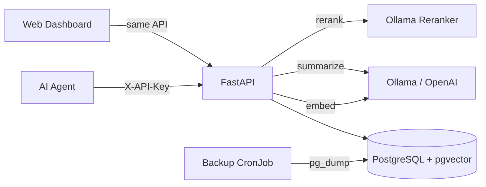

# AgentSSOT

> A cross-LLM shared memory service — give every AI agent durable, scoped, semantic memory.

[](LICENSE)
[](docker-compose.yml)
[](api/)
[](db/)

---

## What is AgentSSOT?

AgentSSOT (**Agent Single Source of Truth**) is a self-hosted memory backend for AI agents. It stores knowledge, events, and requirements in a PostgreSQL database with pgvector, providing both keyword search and semantic recall.

Instead of stuffing entire conversation histories into prompts, agents query AgentSSOT for just the top-K relevant facts they need. Multiple agents (Claude, GPT, Gemini, local models) can share a common memory layer with namespace-based privacy isolation.

The system includes a built-in web dashboard, LLM-friendly onboarding, pluggable embedding/LLM providers (Ollama, OpenAI, or bring-your-own), and an optional cross-encoder reranker for higher-quality recall.

## Features

- **Semantic recall** — vector similarity search via pgvector with optional HNSW indexing
- **Two-stage retrieval** — optional cross-encoder reranker (Ollama) for precision on top of vector recall
- **Namespace isolation** — multi-tenant memory with RBAC (reader / writer / admin)
- **API key auth** — bcrypt-hashed keys with scoped namespace access
- **Pluggable providers** — embeddings and LLM summarization via Ollama, OpenAI, or none
- **Auto-chunking** — knowledge items automatically split to ~800 chars for optimal embedding
- **Session compaction** — background loop summarizes verbose event streams into durable knowledge
- **Built-in web dashboard** — browse, search, and admin panel served at `/`
- **LLM onboarding** — plaintext guide at `/onboarding` tailored to the caller's API key
- **Daily backups** — automated `pg_dump` to local volume

## Architecture



```
agentssot/
├── api/
│   ├── app/
│   │   ├── embeddings/      # Embedding provider plugins
│   │   ├── llm/             # LLM provider plugins (summarization)
│   │   ├── reranker/        # Cross-encoder reranker
│   │   ├── ui/              # Built-in web dashboard (HTML/CSS/JS)
│   │   ├── main.py          # FastAPI routes
│   │   ├── crud.py          # Database operations
│   │   ├── models.py        # SQLAlchemy models
│   │   ├── schemas.py       # Pydantic request/response schemas
│   │   ├── security.py      # Auth + RBAC
│   │   ├── settings.py      # Configuration via env vars
│   │   ├── startup.py       # Bootstrap (namespaces, admin key, HNSW)
│   │   └── background.py    # Compaction loop
│   ├── Dockerfile
│   └── requirements.txt
├── db/
│   └── init/
│       ├── 001_init.sql           # Idempotent schema bootstrap
│       └── 002_optional_hnsw.sql  # HNSW index helper function
├── docker-compose.yml
├── .env.example
└── docs/
    └── ONBOARDING_FOR_LLMS.md
```

## Quick Start

```bash
# 1. Clone
git clone https://github.com/YOUR_USERNAME/agentssot.git
cd agentssot

# 2. Configure
cp .env.example .env
# Edit .env — set at least POSTGRES_PASSWORD

# 3. Launch
docker compose up -d --build

# 4. Capture the bootstrap admin key (printed once on first run)
docker compose logs api | grep BOOTSTRAP_ADMIN_API_KEY

# 5. Open the dashboard
open http://localhost:8088
```

The bootstrap admin key is your first API key — it has full access and is only printed once. Save it immediately.

## API Reference

All authenticated endpoints require the `X-API-Key` header.

| Endpoint | Method | Auth | Description |
|----------|--------|------|-------------|
| `/health` | GET | None | Health check with provider status |
| `/` | GET | None | Web dashboard |
| `/onboarding` | GET | Any | LLM-friendly plaintext onboarding guide |
| `/ingest` | POST | Writer+ | Batch ingest entities, knowledge, events, requirements |
| `/query` | GET | Reader+ | Keyword search with text filtering |
| `/recall` | POST | Reader+ | Semantic vector search (Top-K) |
| `/summarize_clear` | POST | Writer+ | Summarize session events into a knowledge item |
| `/admin/namespaces` | POST | Admin | Create a new namespace |
| `/admin/api-keys` | POST | Admin | Issue a new API key |
| `/admin/api-keys` | GET | Admin | List all API keys (masked) |
| `/admin/delete-items` | POST | Admin | Delete items by ID |
| `/admin/backfill-embeddings` | POST | Admin | Backfill embeddings for existing items |

Full OpenAPI docs available at `/docs` when running.

## Built-in Web Dashboard

The API serves a single-page dashboard at `/` with three tabs:

- **Browse** — paginated knowledge items with tag filtering
- **Search** — semantic recall with score display
- **Admin** — health status, namespace/key management, raw ingest

No build step required — it's plain HTML/CSS/JS calling the same API endpoints.

## Configuration

All configuration is via environment variables (or `.env` file):

| Variable | Default | Description |
|----------|---------|-------------|
| `POSTGRES_PASSWORD` | *(required)* | Database password |
| `DATABASE_URL` | *(from compose)* | PostgreSQL connection string |
| `API_PORT` | `8088` | Port the API listens on |
| `LOG_LEVEL` | `info` | Logging level |
| `EMBEDDING_PROVIDER` | `none` | `none`, `openai`, or `ollama` |
| `EMBEDDING_DIM` | `1536` | Embedding vector dimension (must match model) |
| `OLLAMA_BASE_URL` | `http://host.docker.internal:11434` | Ollama API URL |
| `OLLAMA_EMBED_MODEL` | `nomic-embed-text` | Ollama embedding model name |
| `OPENAI_API_KEY` | *(empty)* | OpenAI API key (if using OpenAI provider) |
| `OPENAI_EMBED_MODEL` | `text-embedding-3-small` | OpenAI embedding model |
| `LLM_PROVIDER` | `none` | `none`, `openai`, or `ollama` (for summarization) |
| `OLLAMA_CHAT_MODEL` | `llama3.1` | Ollama chat model for summarization |
| `OPENAI_CHAT_MODEL` | `gpt-4o-mini` | OpenAI chat model for summarization |
| `RERANKER_PROVIDER` | `none` | `none` or `ollama` |
| `OLLAMA_RERANKER_MODEL` | `dengcao/Qwen3-Reranker-8B:Q8_0` | Ollama reranker model |
| `RERANKER_CANDIDATE_MULTIPLIER` | `3` | Fetch N*top_k candidates for reranking |
| `COMPACTION_ENABLED` | `true` | Enable background session compaction |
| `COMPACTION_INTERVAL_SECONDS` | `60` | Compaction loop interval |
| `COMPACTION_EVENT_THRESHOLD` | `80` | Min events to trigger auto-compaction |
| `COMPACTION_CHAR_THRESHOLD` | `24000` | Min total chars to trigger auto-compaction |
| `ENABLE_HNSW_INDEX` | `false` | Create HNSW indexes on vector columns |
| `DEFAULT_TOP_K` | `5` | Default number of recall results |
| `MAX_SNIPPET_CHARS` | `900` | Max snippet length in query results |
| `BOOTSTRAP_ADMIN_NAMESPACES` | `default` | Comma-separated namespaces for bootstrap admin key |

## Embedding & LLM Providers

AgentSSOT supports three provider modes for both embeddings and LLM summarization:

**`none`** (default) — No server-side embedding/summarization. Clients must provide their own embeddings for recall. Compaction is auto-disabled without an LLM provider.

**`ollama`** — Connect to a local [Ollama](https://ollama.ai) instance. The Docker Compose file maps `host.docker.internal` so containers can reach Ollama on the host. Make sure Ollama listens on a non-loopback interface.

**`openai`** — Use OpenAI's API. Set `OPENAI_API_KEY` in your `.env`.

### Two-Stage Reranking

When `RERANKER_PROVIDER=ollama`, recall uses a two-stage pipeline:
1. Vector search fetches `top_k * RERANKER_CANDIDATE_MULTIPLIER` candidates
2. A cross-encoder reranker rescores them for higher precision

If the reranker fails, results gracefully fall back to vector-only ranking.

## Security Model

- **API key authentication** on all endpoints except `/health`
- Keys are **bcrypt-hashed** in the database (no plaintext storage)
- **RBAC** with three roles: `reader`, `writer`, `admin`
- **Namespace isolation** — each key is scoped to specific namespaces
- Bootstrap admin key generated and logged once on first startup

### Recommended Namespace Pattern

```
team-shared          # Explicit shared namespace
agent-a-private      # Per-agent private memory
finance-private      # Per-domain private memory
```

Issue API keys with the minimum required namespaces. This creates siloed memory with explicit opt-in sharing.

## LLM Agent Integration

The killer feature: any LLM agent can use AgentSSOT as persistent memory in three steps:

1. **Start of task** — recall relevant context:
   ```bash
   # Keyword search
   curl -H "X-API-Key: $KEY" "http://localhost:8088/query?namespace=default&q=auth+setup"

   # Semantic search
   curl -H "X-API-Key: $KEY" -X POST http://localhost:8088/recall \
     -d '{"namespace":"default","scope":"knowledge","query_text":"how is auth configured?","top_k":5}'
   ```

2. **During task** — ingest decisions and facts:
   ```bash
   curl -H "X-API-Key: $KEY" -X POST http://localhost:8088/ingest \
     -d '{"namespace":"default","knowledge_items":[{"content":"JWT auth uses RS256","tags":["auth","config"]}]}'
   ```

3. **End of task** — summarize session events:
   ```bash
   curl -H "X-API-Key: $KEY" -X POST http://localhost:8088/summarize_clear \
     -d '{"namespace":"default","session_id":"session-abc123"}'
   ```

See [`docs/ONBOARDING_FOR_LLMS.md`](docs/ONBOARDING_FOR_LLMS.md) for the full agent onboarding guide, or hit `GET /onboarding` with an API key for a version tailored to that key's permissions.

## Contributing

See [CONTRIBUTING.md](CONTRIBUTING.md) for setup instructions and PR guidelines.

## License

[MIT](LICENSE)
