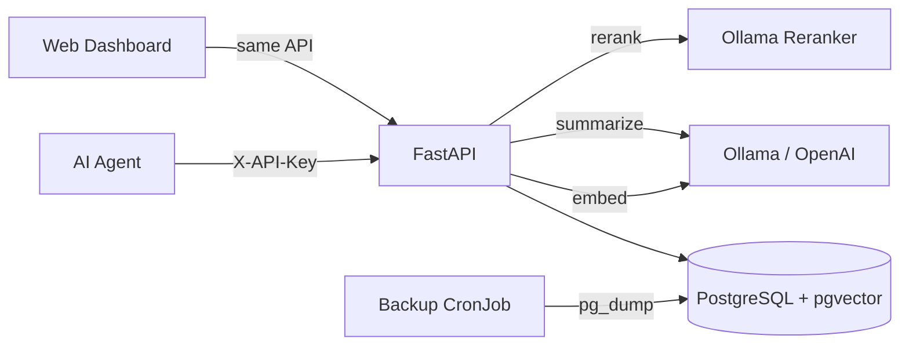

# AgentSSOT

> A local-first memory control plane for agents that need durable context across
> models, tools, devices, and sessions.

[](LICENSE)
[](docker-compose.yml)
[](api/)
[](db/)
[](https://github.com/maddefientist/agentssot/actions/workflows/test.yml)

---

## Why AgentSSOT?

Modern agents already have larger context windows and better local tools. The
remaining problem is coordination: one agent cannot safely assume another
agent's transcript, filesystem, or provider-specific memory is available or
current.

AgentSSOT (**Agent Single Source of Truth**) provides a self-hosted place for
durable facts, decisions, requirements, and events. Agents can use exact search
or bounded semantic recall, receive stable item IDs for feedback, and share only
the namespaces their API keys permit.

It complements MCP and agent-to-agent protocols; it is not an agent runtime,
model router, or replacement for the current repository, live runtime, or web.

### Use memory when

- a past decision or correction affects today's task;
- multiple agents need the same durable operating context;
- a long-running project spans sessions, models, or devices; or
- an exact source reference or prior outcome needs to be recovered.

### Skip memory when

- the prompt or checked-out repository already contains the answer;
- the fact is live state that should be verified directly;
- the task is self-contained and recall would only add latency; or
- no sufficiently relevant result is found. `NO_MEMORY_NEEDED` is a valid outcome.

## Product boundary

| Layer | Status | Purpose |
|---|---|---|
| Memory kernel | Core | Auth, namespaces, ingest, exact query, bounded recall, feedback |
| Dashboard and onboarding | Core | Inspect data, issue keys, and integrate agents |
| Typed memory and lifecycle | Optional | Classification, expiry, supersession, loadouts, review |
| Synthesis and reranking | Optional, off by default | More expensive local-model automation; evaluate before enabling |
| Gateway/HUD | Experimental, off by default | Operator command/status transport; not required for memory |

The secure default exposes only the memory service on loopback. Agent admission
uses admin-issued, single-use enrollment tokens; passphrase self-enrollment is
not shipped. The model/tool gateway requires explicit operator configuration.

## Core capabilities

- **Bounded retrieval** — exact PostgreSQL search and semantic pgvector recall with a total Top-K budget
- **Namespace isolation** — multi-tenant memory with RBAC (reader / writer / admin)
- **API key auth** — bcrypt-hashed keys with scoped namespace access
- **Correctable records** — stable IDs, explicit feedback, expiry, and supersession fields
- **Pluggable providers** — Ollama, OpenAI, or client-supplied embeddings
- **Bounded chunking** — oversized knowledge items are split into configurable, reviewable chunks
- **Optional compaction** — summarize verbose event streams into durable knowledge
- **Built-in web dashboard** — browse, search, and admin panel served at `/`
- **Agent onboarding** — public enrollment instructions at `/onboarding` and key-specific guidance at `/onboarding/me`
- **Validated backups** — automated `pg_dump` archives checked before atomic publication

AgentSSOT does not assume that memory always helps. Evaluate retrieval precision,
stale-memory harm, abstention behavior, token cost, and p95 latency on your own
workload before enabling reranking, synthesis, or automatic session loadouts.

## Architecture


```mermaid
graph LR
    A[AI Agent] -->|X-API-Key| B[FastAPI]
    B --> C[(PostgreSQL + pgvector)]
    B -->|embed| D[Ollama / OpenAI]
    B -->|summarize| D
    B -->|rerank| E[Ollama Reranker]
    F[Web Dashboard] -->|same API| B
    G[Backup CronJob] -->|pg_dump| C
```

```
agentssot/
├── api/
│   ├── app/
│   │   ├── embeddings/      # Embedding provider plugins
│   │   ├── llm/             # LLM provider plugins (summarization)
│   │   ├── reranker/        # Optional model-based reranking
│   │   ├── ui/              # Built-in web dashboard (HTML/CSS/JS)
│   │   ├── main.py          # FastAPI routes
│   │   ├── crud.py          # Database operations
│   │   ├── models.py        # SQLAlchemy models
│   │   ├── schemas.py       # Pydantic request/response schemas
│   │   ├── security.py      # Auth + RBAC
│   │   ├── settings.py      # Configuration via env vars
│   │   ├── startup.py       # Bootstrap (namespaces, admin key, HNSW)
│   │   └── background.py    # Compaction loop
│   ├── Dockerfile
│   └── requirements.txt
├── db/
│   └── init/
│       ├── 001_init.sql           # Idempotent schema bootstrap
│       └── 002_optional_hnsw.sql  # HNSW index helper function
├── docker-compose.yml
├── .env.example
└── docs/
    └── ONBOARDING_FOR_LLMS.md
```

## Quick Start

```bash
# 1. Clone
git clone https://github.com/maddefientist/agentssot.git
cd agentssot

# 2. Configure
cp .env.example .env
# Edit .env — set POSTGRES_PASSWORD and a one-time BOOTSTRAP_ADMIN_API_KEY.
# Generate the latter locally, for example:
python -c 'import secrets; print("ssot_" + secrets.token_urlsafe(32))'

# 3. Launch
docker compose up -d --build

# 4. Open the dashboard
open http://localhost:8088
```

The bootstrap admin key is the value you supplied; it is hashed in the database
and never printed by the service. After the first successful start, remove
`BOOTSTRAP_ADMIN_API_KEY` from `.env` and keep the plaintext in your secret
manager. Existing databases with an API key do not require this setting.

## API Reference

All authenticated endpoints require the `X-API-Key` header.

| Endpoint | Method | Auth | Description |
|----------|--------|------|-------------|
| `/health` | GET | None | Health check with provider status |
| `/` | GET | None | Web dashboard |
| `/onboarding` | GET | None | Public enrollment-token onboarding guide |
| `/enroll` | POST | Token | Redeem an admin-issued, single-use enrollment token |
| `/ingest` | POST | Writer+ | Batch ingest entities, knowledge, events, requirements |
| `/query` | GET | Reader+ | Keyword search with text filtering |
| `/recall` | POST | Reader+ | Semantic vector search (Top-K) |
| `/summarize_clear` | POST | Writer+ | Summarize session events into a knowledge item |
| `/admin/namespaces` | POST | Admin | Create a new namespace |
| `/admin/api-keys` | POST | Admin | Issue a new API key |
| `/admin/api-keys` | GET | Admin | List all API keys (masked) |
| `/admin/delete-items` | POST | Admin | Delete items by ID |
| `/admin/backfill-embeddings` | POST | Admin | Backfill embeddings for existing items |

Full OpenAPI docs available at `/docs` when running.

## Built-in Web Dashboard

The API serves a single-page dashboard at `/` with three tabs:

- **Browse** — paginated knowledge items with tag filtering
- **Search** — semantic recall with score display
- **Admin** — health status, namespace/key management, raw ingest

No build step required — it's plain HTML/CSS/JS calling the same API endpoints.

## Optional Gateway/HUD Layer

The repository contains an experimental operator gateway/HUD and live provider
configuration endpoints. They are not part of the public memory kernel. The
gateway is absent unless `GATEWAY_ENABLED=true`; when enabled it requires an
authorized admin to mint short-lived, single-use transport tickets and
revalidates established connections after revocation. Orchestration and
dispatch remain fail-closed unless the operator separately sets
`GATEWAY_EXECUTION_ENABLED=true`.

Because tickets and abuse limits are process-local, enabled mode is restricted
to one API worker and must use the image's owned entrypoint; direct ASGI
launchers fail closed. Keep it behind TLS and an authenticated network boundary.
Before enabling it or connecting any external identity, read
[`docs/SECURE_CONTROL_PLANE.md`](docs/SECURE_CONTROL_PLANE.md). Future task and
approval receipts described there are a design gate, not a shipped production
control plane.

## MCP tool profiles

The default `core` MCP profile exposes six bounded tools: exact query, recall,
ingest, teach, feedback, and expand. Administrative, lifecycle, Cortex,
synthesis, loadout, and Synapse tools require an explicit `operator` profile so
ordinary agents do not spend context or receive authority they do not need.

## Configuration

All configuration is via environment variables (or `.env` file):

| Variable | Default | Description |
|----------|---------|-------------|
| `POSTGRES_PASSWORD` | *(required)* | Database password |
| `DATABASE_URL` | *(from compose)* | PostgreSQL connection string |
| `API_PORT` | `8088` | Port the API listens on |
| `API_BIND_HOST` | `127.0.0.1` | Interface for the API port; opt in to wider exposure |
| `LOG_LEVEL` | `info` | Logging level |
| `EMBEDDING_PROVIDER` | `none` | `none`, `openai`, or `ollama` |
| `EMBEDDING_DIM` | `1536` | Embedding vector dimension (must match model) |
| `OLLAMA_BASE_URL` | `http://host.docker.internal:11434` | Ollama API URL |
| `OLLAMA_EMBED_MODEL` | `nomic-embed-text` | Ollama embedding model name |
| `OPENAI_API_KEY` | *(empty)* | OpenAI API key (if using OpenAI provider) |
| `OPENAI_EMBED_MODEL` | `text-embedding-3-small` | OpenAI embedding model |
| `LLM_PROVIDER` | `none` | `none`, `openai`, or `ollama` (for summarization) |
| `OLLAMA_CHAT_MODEL` | `llama3.1` | Ollama chat model for summarization |
| `OPENAI_CHAT_MODEL` | `gpt-4o-mini` | OpenAI chat model for summarization |
| `RERANKER_PROVIDER` | `none` | `none` or `ollama` |
| `OLLAMA_RERANKER_MODEL` | `dengcao/Qwen3-Reranker-8B:Q8_0` | Ollama reranker model |
| `RERANKER_CANDIDATE_MULTIPLIER` | `3` | Fetch N*top_k candidates for reranking |
| `GATEWAY_ENABLED` | `false` | Enable the experimental operator gateway/HUD |
| `GATEWAY_EXECUTION_ENABLED` | `false` | Separately enable gateway orchestration and dispatch |
| `GATEWAY_MAX_FRAME_BYTES` | `16384` | WebSocket transport frame ceiling |
| `GATEWAY_CONNECTION_TTL_SECONDS` | `300` | Maximum WebSocket/SSE lifetime before re-authentication |
| `BOOTSTRAP_ADMIN_API_KEY` | *(required on an empty database)* | Operator-generated initial admin key; hashed and never logged |
| `COMPACTION_ENABLED` | `true` | Enable background session compaction |
| `COMPACTION_INTERVAL_SECONDS` | `60` | Compaction loop interval |
| `COMPACTION_EVENT_THRESHOLD` | `80` | Min events to trigger auto-compaction |
| `COMPACTION_CHAR_THRESHOLD` | `24000` | Min total chars to trigger auto-compaction |
| `ENABLE_HNSW_INDEX` | `false` | Create HNSW indexes on vector columns |
| `DEFAULT_TOP_K` | `5` | Default number of recall results |
| `MAX_SNIPPET_CHARS` | `900` | Max snippet length in query results |
| `BOOTSTRAP_ADMIN_NAMESPACES` | `default` | Comma-separated namespaces for bootstrap admin key |

## Embedding & LLM Providers

AgentSSOT supports three provider modes for both embeddings and LLM summarization:

**`none`** (default) — No server-side embedding/summarization. Clients must provide their own embeddings for recall. Compaction is auto-disabled without an LLM provider.

**`ollama`** — Connect to a local [Ollama](https://ollama.ai) instance. The Docker Compose file maps `host.docker.internal` so containers can reach Ollama on the host. Make sure Ollama listens on a non-loopback interface.

**`openai`** — Use OpenAI's API. Set `OPENAI_API_KEY` in your `.env`.

### Optional Two-Stage Reranking

Reranking is an opt-in quality/latency tradeoff. When
`RERANKER_PROVIDER=ollama` and a caller requests reranking, recall uses a
two-stage pipeline:
1. Vector search fetches `top_k * RERANKER_CANDIDATE_MULTIPLIER` candidates
2. A configured model-based reranker rescores them

If the reranker fails, results fall back to vector-only ranking. Do not enable
it merely because a model is available: measure whether it improves accepted
results enough to justify shared GPU time and tail latency.

## Security Model

- **Secure network default** — Compose binds the API to `127.0.0.1`; LAN exposure requires an explicit `API_BIND_HOST` override
- **API key authentication** on data and administrative APIs; public exceptions are limited to health, static UI/onboarding assets, and token redemption
- Keys are **bcrypt-hashed** in the database (no plaintext storage)
- **RBAC** with three roles: `reader`, `writer`, `admin`
- **Namespace isolation** — each key is scoped to specific namespaces
- The `admin` role is global control-plane authority; it is not delegated
  administration limited by that key's namespace list
- Bootstrap admin key supplied once by the operator, hashed, and never logged
- **Fail-closed enrollment** — admission uses admin-issued, single-use tokens; passphrase writer-key enrollment is not shipped
- **Fail-closed gateway** — model/tool execution is disabled by default and uses admin-authorized, single-use browser tickets when enabled

Do not set `API_BIND_HOST=0.0.0.0` until an authenticated network boundary is in place.

### Recommended Namespace Pattern

```
team-shared          # Explicit shared namespace
agent-a-private      # Per-agent private memory
finance-private      # Per-domain private memory
```

Issue API keys with the minimum required namespaces. This creates siloed memory with explicit opt-in sharing.

## Agent integration

Use the smallest loop the task needs. A self-contained task should make no
memory call at all.

1. **When prior context can help** — query exact identifiers first, then use
   semantic recall if needed:
   ```bash
   # Keyword search
   curl -H "X-API-Key: $KEY" "http://localhost:8088/query?namespace=default&q=auth+setup"

   # Semantic search
   curl -H "X-API-Key: $KEY" -X POST http://localhost:8088/recall \
     -d '{"namespace":"default","scope":"knowledge","query_text":"how is auth configured?","top_k":5}'
   ```

2. **When something becomes durable** — ingest an atomic decision or fact:
   ```bash
   curl -H "X-API-Key: $KEY" -X POST http://localhost:8088/ingest \
     -d '{"namespace":"default","knowledge_items":[{"content":"JWT auth uses RS256","tags":["auth","config"]}]}'
   ```

3. **For a genuinely long session** — compact its event stream:
   ```bash
   curl -H "X-API-Key: $KEY" -X POST http://localhost:8088/summarize_clear \
     -d '{"namespace":"default","session_id":"session-abc123"}'
   ```

See [`docs/ONBOARDING_FOR_LLMS.md`](docs/ONBOARDING_FOR_LLMS.md) for the full
agent onboarding guide. `GET /onboarding` is public; `GET /onboarding/me`
requires an API key and reports that key's permissions.

## Contributing

See [CONTRIBUTING.md](CONTRIBUTING.md) for setup instructions and PR guidelines.

## License

[MIT](LICENSE)
